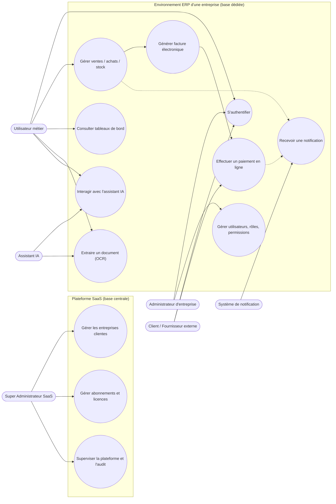

Diagramme de cas d'utilisation — Plateforme ERP SaaS intelligente

> Version 2 — mise à jour suite au cadrage de l'entreprise sur l'architecture
> SaaS Multi-Tenant / Multi-Database (voir cahier des charges, section 2 et 3).

## Acteurs

Le modèle de permissions retenu est : `Entreprise → Utilisateur → Rôle →
Permission → Module → Action`.

| Niveau | Acteur | Description |
|---|---|---|
| Plateforme | **Super Administrateur SaaS** | Gère la plateforme globale : entreprises clientes, abonnements, licences, sécurité et audit globaux. **N'a pas accès** aux données métier des entreprises. |
| Entreprise | **Administrateur d'entreprise** | Administre son propre environnement : utilisateurs, rôles, permissions, départements, modules métier activés. |
| Entreprise | **Utilisateur métier** | Utilise les modules selon son rôle : Commercial, Achats, Stock, Facturation, Comptabilité, RH, Gestion. |
| Entreprise (externe) | **Client / Fournisseur** *(entité métier, portail externe)* | Consulte devis/factures, paie en ligne — ce n'est pas un utilisateur interne du système. |
| Transversal | **Assistant IA** *(acteur secondaire)* | Assiste les utilisateurs selon leurs droits ; automatise l'extraction de documents (OCR). |
| Transversal | **Système de notification** *(acteur secondaire)* | Envoie les notifications multicanales déclenchées par la plateforme. |

## Diagramme (Mermaid — s'affiche automatiquement sur GitHub)

## Notes de modélisation

- Les traits pleins représentent une association acteur → cas d'utilisation.
- Les traits pointillés représentent une relation `<<include>>` implicite
  (ex : une vente déclenche une notification).
- **Le découpage en deux sous-systèmes (Plateforme SaaS / Environnement ERP)
  reflète directement l'architecture multi-tenant** : la base centrale gère
  les cas d'utilisation du Super Administrateur, chaque base entreprise gère
  les cas d'utilisation internes à cette entreprise.
- Ce diagramme reste synthétique au niveau global. Chaque module métier
  (stocks, achats, ventes, RH, comptabilité...) pourra être détaillé dans un
  diagramme plus fin au fur et à mesure de l'avancement
  (`02-cas-utilisation-stocks.md`, etc.).
- Le cas d'utilisation "S'authentifier" est volontairement simplifié ici : le
  détail technique du routage vers la bonne base entreprise sera précisé
  dans le diagramme de séquence dédié (`docs/uml/02-sequence-routage-multi-tenant.md`).
- Prochaine étape : diagramme de séquence du routage multi-tenant, puis
  diagramme de classes (`docs/uml/03-diagramme-classes.md`), qui séparera
  explicitement les entités de la base centrale et celles d'une base
  entreprise.

## Répartition suggérée pour le binôme

- **Membre A** : cas d'utilisation liés à l'ERP cœur et à la plateforme SaaS
  (authentification, multi-tenant, utilisateurs/rôles, ventes/achats/stock,
  facturation, paiement, sécurité).
- **Membre B** : cas d'utilisation liés à la donnée et aux services avancés
  (tableaux de bord, Data Engineering, assistant IA, OCR, notifications).

Les deux doivent valider ensemble ce diagramme avant de passer au diagramme
de classes, car les deux volets partagent les mêmes entités de base
(Utilisateur, Commande, Produit...) et la même logique de routage
multi-tenant.