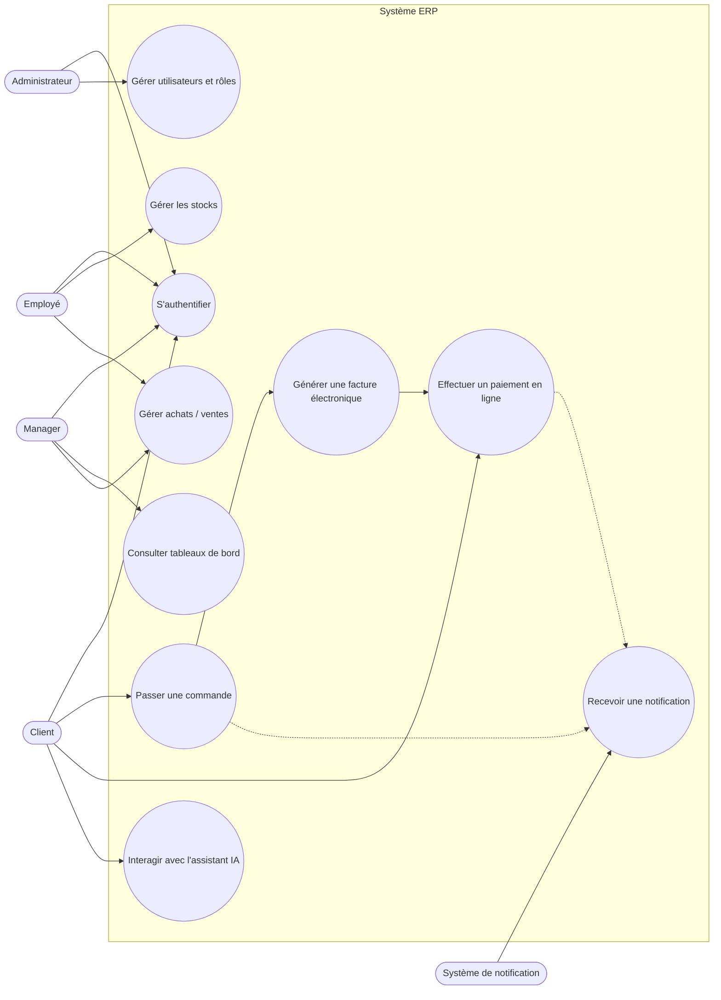

# Diagramme de cas d'utilisation — Plateforme ERP intelligente

## Acteurs

| Acteur | Description |
|---|---|
| **Administrateur** | Gère les utilisateurs, les rôles, la configuration multilingue du système |
| **Employé** | Utilise les modules métier au quotidien (stocks, achats, ventes) |
| **Manager** | Valide les opérations, consulte les tableaux de bord décisionnels |
| **Client** | Passe des commandes, paie en ligne, échange avec l'assistant IA |
| **Système de notification** *(acteur secondaire)* | Envoie les notifications multicanales déclenchées par l'ERP |

## Diagramme (Mermaid — s'affiche automatiquement sur GitHub)

## Notes de modélisation

- Les traits pleins représentent une association acteur → cas d'utilisation.
- Les traits pointillés représentent une relation `<<include>>` implicite
  (ex : passer une commande déclenche une notification).
- Ce diagramme est volontairement synthétique. Chaque module (stocks, achats,
  ventes, RH, comptabilité...) pourra être détaillé dans un diagramme de cas
  d'utilisation plus fin dans un fichier séparé au fur et à mesure de
  l'avancement (`02-cas-utilisation-stocks.md`, etc.).
- Prochaine étape : diagramme de classes (`docs/uml/03-diagramme-classes.md`),
  qui traduira chaque cas d'utilisation en entités et relations, base directe
  du modèle de données (`docs/mcd`).

## Répartition suggérée pour le binôme

- **Membre A** : cas d'utilisation liés à l'ERP cœur (authentification,
  utilisateurs, stocks, achats/ventes, facturation, paiement).
- **Membre B** : cas d'utilisation liés à la donnée et aux services avancés
  (tableaux de bord, assistant IA, notifications).

Les deux doivent valider ensemble ce diagramme avant de passer au diagramme
de classes, car les deux volets partagent les mêmes entités de base
(Utilisateur, Commande, Produit...).
