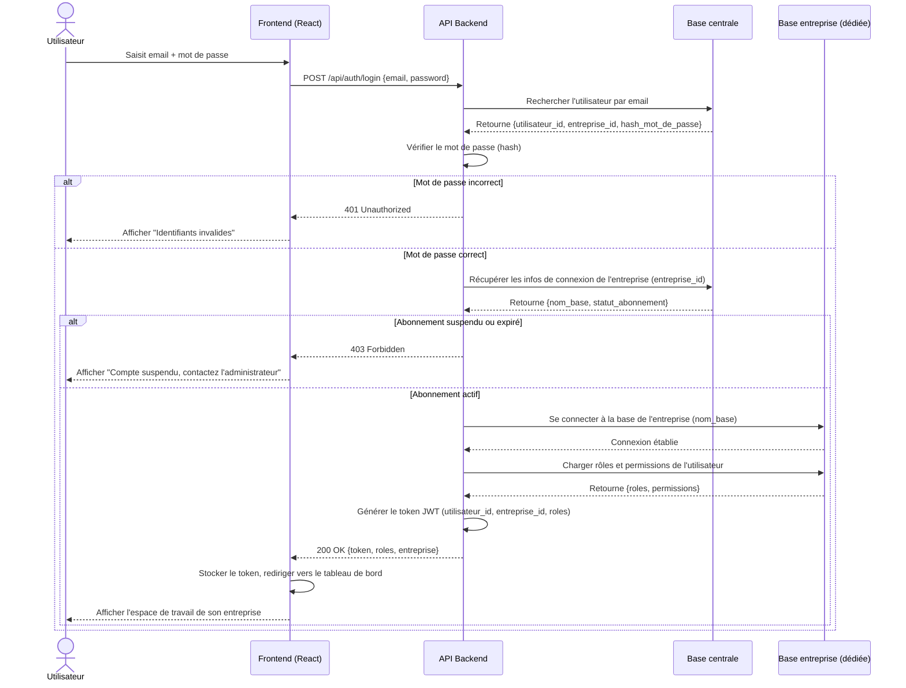

# Diagramme de séquence — Routage multi-tenant

> Diagramme 2 de la phase de conception UML. Montre étape par étape ce qui
> se passe entre le moment où un utilisateur se connecte et le moment où il
> accède à son environnement ERP.

## Description du scénario

Un utilisateur (Administrateur d'entreprise ou utilisateur métier) se
connecte à la plateforme. Le système doit identifier automatiquement à
quelle entreprise il appartient, puis le rediriger vers la base de données
isolée de cette entreprise, avec ses rôles et permissions déjà chargés.

## Diagramme (Mermaid — s'affiche automatiquement sur GitHub)

## Points clés à expliquer en soutenance

1. **La base centrale ne contient jamais de données métier** — elle sert
   uniquement à savoir *qui* appartient à *quelle entreprise* et si son
   abonnement est valide.
2. **Le token JWT contient l'`entreprise_id`** — cela permet à chaque appel
   API suivant de savoir directement dans quelle base entreprise chercher
   les données, sans repasser par la base centrale à chaque requête.
3. **Le contrôle de l'abonnement se fait à la connexion** — si une
   entreprise n'a pas payé ou a dépassé sa période d'essai, l'accès est
   bloqué avant même d'atteindre sa base de données.
4. **La connexion à la base entreprise est dynamique** — le backend ne
   connaît pas à l'avance quelle base utiliser, il le déduit à chaque
   connexion depuis les informations de la base centrale.

## Choix technique à trancher avec votre binôme

Deux approches possibles pour implémenter concrètement "une base par
entreprise" — à décider avant de commencer le développement :

| Approche | Description | Avantage | Inconvénient |
|---|---|---|---|
| **Base physique séparée** | Une vraie base PostgreSQL différente par entreprise (`societe_alpha`, `societe_tech`...) | Isolation maximale, conforme à la demande de l'entreprise | Plus complexe à gérer avec beaucoup d'entreprises |
| **Schéma séparé dans une même base** | Une seule base PostgreSQL, un schéma différent par entreprise (`alpha.utilisateurs`, `tech.utilisateurs`...) | Plus simple à administrer techniquement | Isolation légèrement moins forte |

**Recommandation pour un projet de 3 mois** : commencez par l'approche
"base physique séparée", car c'est exactement ce que décrit le cahier des
charges (`societe_alpha.sql`, `societe_tech.sql`...) — plus simple à
justifier et à expliquer tel quel en soutenance.
