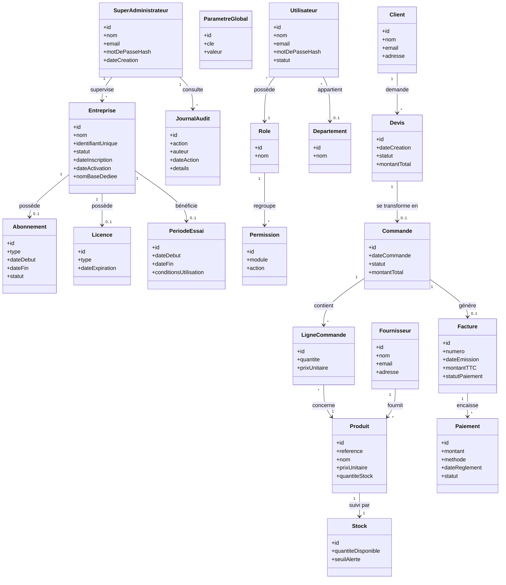

# Diagramme de classes — Plateforme ERP SaaS intelligente

> Ce diagramme traduit les cas d'utilisation (`01-diagramme-cas-utilisation.md`)
> en entités et relations, en respectant le découpage en deux bases imposé
> par l'architecture Multi-Tenant / Multi-Database (voir cahier des charges,
> section 3).

## Principe de séparation

Le modèle est découpé en **deux groupes de classes**, correspondant aux deux
bases de données réelles du système :

- **Base centrale** (`Base_Centrale.sql`) — gère la plateforme SaaS elle-même
  (entreprises clientes, abonnements, sécurité globale).
- **Base entreprise** (`societe_xxx.sql`) — une base indépendante par
  entreprise cliente, contenant toutes les données métier de son ERP.

Il n'y a **aucune clé étrangère directe en base** entre les deux : le seul
lien logique est `Entreprise.nomBaseDediee`, résolu au moment du routage
dynamique après authentification (cf. diagramme de séquence dédié).

## Diagramme (Mermaid — s'affiche automatiquement sur GitHub)

## Notes de modélisation

- **Séparation stricte des deux bases** : les classes du haut
  (`SuperAdministrateur`, `Entreprise`, `Abonnement`, `Licence`,
  `PeriodeEssai`, `JournalAudit`, `ParametreGlobal`) vivent dans
  `Base_Centrale.sql`. Toutes les autres classes vivent dans la base dédiée
  de chaque entreprise (`societe_xxx.sql`).
- Les entités **métier** (Client, Fournisseur, Produit, Commande...) ne sont
  pas des utilisateurs du système, conformément à la section 2 du cahier des
  charges.
- Le processus `Devis → Commande → Facture → Paiement` correspond au flux
  métier documenté en section 5 du cahier des charges.
- Simplification volontaire : les entités liées à la comptabilité, RH et
  gestion documentaire avancée (bons de livraison, écritures comptables,
  etc.) ne sont pas détaillées ici pour rester lisible — mentionnées comme
  extensions possibles plutôt qu'ajoutées intégralement.

## Prochaine étape

Diagrammes de séquence des processus métier ERP
(`docs/uml/04-sequence-processus-metier.md`) : `Client → Devis → Commande →
Facture → Paiement` et `Fournisseur → Achat → Réception → Stock →
Facturation`.
