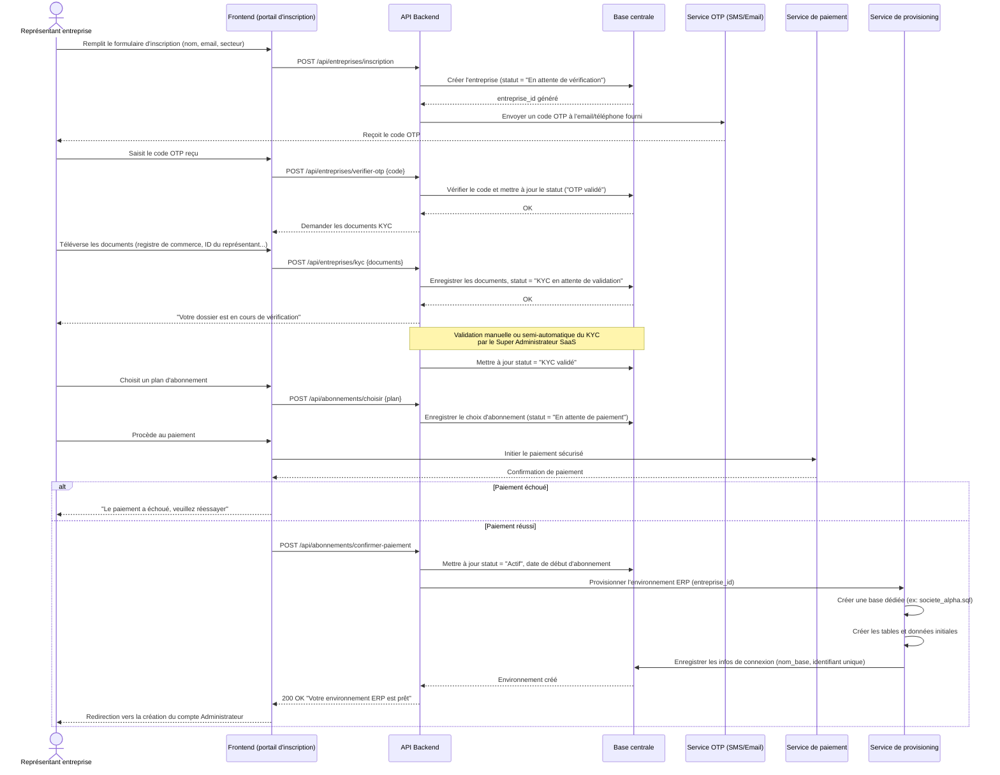

# Diagramme de séquence — Onboarding d'une entreprise cliente

> Diagramme 3 de la phase de conception UML. Montre comment une nouvelle
> entreprise s'inscrit sur la plateforme et obtient automatiquement son
> propre environnement ERP.

## Description du scénario

Une entreprise souhaite devenir cliente de la plateforme SaaS. Elle doit
s'inscrire, vérifier son identité (OTP puis KYC), choisir un abonnement,
payer, puis voir son environnement ERP créé automatiquement — sans
intervention manuelle du Super Administrateur pour la création technique.

## Diagramme (Mermaid — s'affiche automatiquement sur GitHub)

## Points clés à expliquer en soutenance

1. **Chaque étape met à jour un statut dans la base centrale** —
   ce statut pilote le diagramme d'états-transitions (diagramme suivant).
2. **Le provisioning est automatique** : dès le paiement confirmé, la base
   dédiée à l'entreprise est créée sans intervention humaine, exactement
   comme demandé dans le cahier des charges.
3. **La vérification KYC peut être manuelle** dans une première version
   simple (le Super Admin valide depuis un tableau de bord), et automatisée
   plus tard si le temps le permet.
4. **Le mode Trial** peut être modélisé comme une variante : l'entreprise
   passe directement de "KYC validé" à "Actif (essai)" sans passer par le
   paiement, avec une date d'expiration d'essai enregistrée dans la base
   centrale.

## Lien avec le diagramme suivant

Les statuts mentionnés ici (`En attente de vérification`, `OTP validé`,
`KYC en attente`, `KYC validé`, `En attente de paiement`, `Actif`,
`Suspendu`...) seront repris et complétés dans le **diagramme
d'états-transitions du cycle de vie du compte entreprise**
(`docs/uml/03-etats-cycle-de-vie-entreprise.md`).
