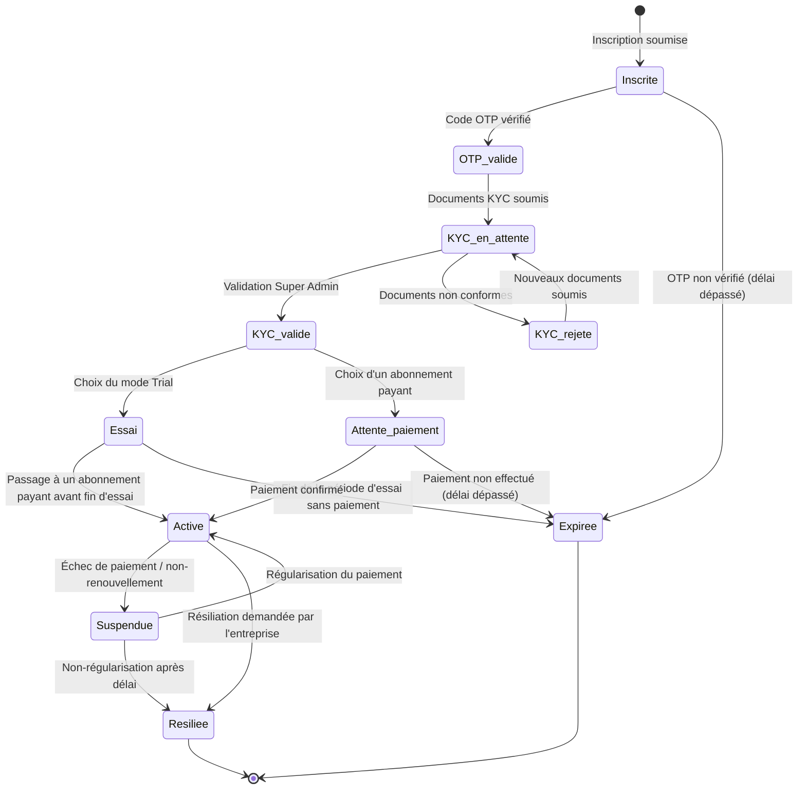

# Diagramme d'états-transitions — Cycle de vie du compte entreprise

> Diagramme 4 de la phase de conception UML. Découle directement du
> diagramme de séquence d'onboarding (`03-sequence-onboarding-entreprise.md`)
> : il montre tous les états possibles d'une entreprise cliente et les
> événements qui la font passer d'un état à un autre.

## Description

Chaque entreprise cliente possède un statut, stocké dans la base centrale,
qui détermine ce qu'elle peut faire sur la plateforme (se connecter, accéder
à son ERP, etc.). Ce diagramme sert de référence unique pour tous les
statuts possibles — évitez d'en inventer de nouveaux ailleurs dans le code
sans les ajouter ici d'abord.

## Diagramme (Mermaid — s'affiche automatiquement sur GitHub)

## Description des états

| État | Signification | Accès à l'ERP ? |
|---|---|---|
| `Inscrite` | Formulaire d'inscription soumis, en attente de vérification OTP | Non |
| `OTP_valide` | Email/téléphone vérifié | Non |
| `KYC_en_attente` | Documents envoyés, en attente de validation | Non |
| `KYC_rejete` | Documents refusés, doit en soumettre de nouveaux | Non |
| `KYC_valide` | Identité de l'entreprise confirmée | Non |
| `Essai` | Période Trial en cours, environnement ERP actif avec limites | Oui (limité) |
| `Attente_paiement` | Abonnement choisi, paiement non encore confirmé | Non |
| `Active` | Abonnement payé et en cours, environnement ERP pleinement actif | Oui (complet) |
| `Suspendue` | Paiement en échec ou non renouvelé, accès bloqué temporairement | Non (données conservées) |
| `Resiliee` | Compte définitivement fermé à la demande de l'entreprise | Non |
| `Expiree` | Processus d'inscription abandonné ou essai non transformé | Non |

## Points clés à expliquer en soutenance

1. **`Suspendue` conserve les données** (contrairement à `Resiliee`) —
   c'est ce qui permet à une entreprise de régulariser sa situation et de
   retrouver l'accès sans tout reconfigurer.
2. **Le mode `Essai` a un accès limité** — à définir précisément avec
   l'entreprise (ex : nombre d'utilisateurs limité, certains modules
   désactivés, durée de 14 ou 30 jours).
3. **Ce diagramme correspond directement à une colonne `statut` dans la
   table `Entreprise` de la base centrale** — chaque transition doit être
   déclenchée par une action précise du backend (webhook de paiement, tâche
   planifiée de vérification d'expiration, action du Super Admin...).

## Prochaine étape

Ce diagramme clôt la partie "plateforme SaaS" de la conception. On peut
maintenant passer au **diagramme de classes** (`04-diagramme-classes.md`),
qui traduira l'ensemble des cas d'utilisation et des flux vus jusqu'ici en
entités concrètes de base de données.
