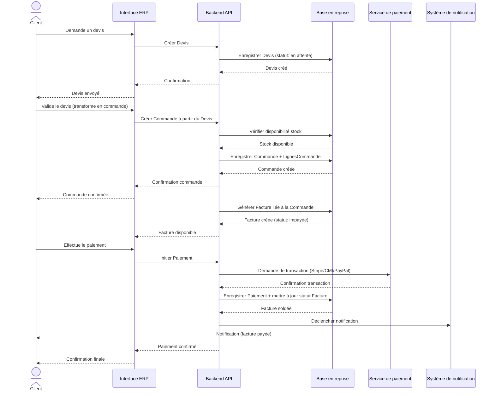
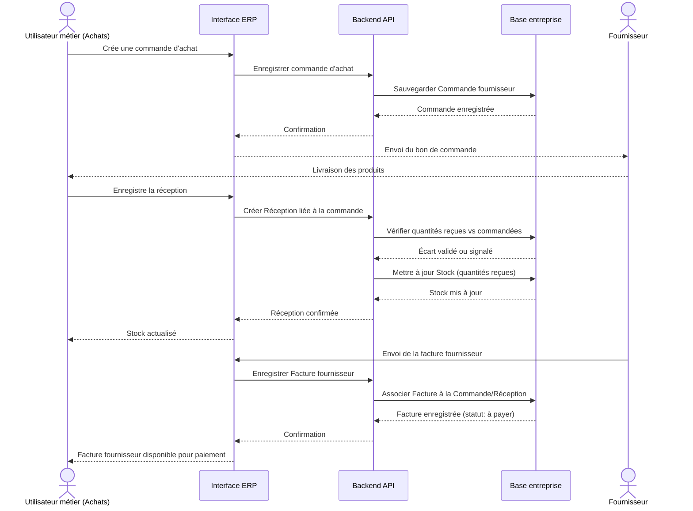

# Diagrammes de séquence — Processus métier ERP

> Ces diagrammes détaillent, dans le temps, les échanges entre acteurs et
> composants du système pour les deux processus métier de référence décrits
> en section 5 du cahier des charges. Ils s'appuient directement sur les
> classes définies dans `03-diagramme-classes.md`.

## 1. Processus de vente : Client → Devis → Commande → Facture → Paiement

## 2. Processus d'achat : Fournisseur → Achat → Réception → Stock → Facturation

## Notes de modélisation

- Les deux séquences se déroulent **entièrement à l'intérieur d'une base
  entreprise** : le routage multi-tenant (sélection de la bonne base après
  authentification) est déjà traité dans le diagramme de séquence dédié de
  ton amie et n'est pas répété ici.
- Le processus de vente inclut le service de paiement externe et le système
  de notification, conformément au flux détaillé dans
  `01-diagramme-cas-utilisation.md`.
- Le processus d'achat reste volontairement simple (pas de gestion des
  litiges ou des avoirs fournisseurs) pour rester lisible ; ces cas
  pourront être mentionnés comme extensions possibles dans le rapport final.
- Les deux diagrammes réutilisent exactement les classes définies dans
  `03-diagramme-classes.md` (Devis, Commande, LigneCommande, Facture,
  Paiement, Produit, Stock, Fournisseur).

## Prochaine étape

Diagramme d'activité de l'automatisation documentaire par IA/OCR
(`docs/uml/05-activite-ocr.md`) : `Document → OCR → Extraction intelligente
→ Contrôle → Validation utilisateur → Intégration ERP`.
