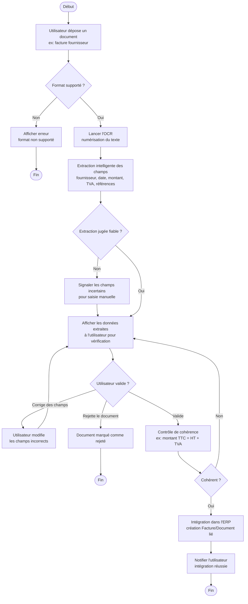

# Diagramme d'activité — Automatisation documentaire par IA (OCR)

> Ce diagramme détaille le processus d'automatisation documentaire décrit en
> section 7 du cahier des charges : extraction intelligente d'informations
> à partir d'un document (ex. facture fournisseur), avec validation humaine
> avant intégration dans l'ERP.

## Flux général

```
Document → OCR → Extraction intelligente → Contrôle → Validation
(utilisateur) → Intégration ERP
```

## Diagramme (Mermaid — s'affiche automatiquement sur GitHub)



## Notes de modélisation

- **La validation humaine reste obligatoire avant toute intégration** dans
  l'ERP, conformément à la section 7 du cahier des charges ("la validation
  finale est effectuée par l'utilisateur avant intégration").
- Le contrôle de cohérence (ex. vérifier que le montant TTC correspond bien
  au HT + TVA extraits) est une étape de sécurité pour éviter d'intégrer des
  données erronées issues d'une mauvaise lecture OCR.
- Ce flux s'applique en priorité aux **factures fournisseurs**, mais peut
  être réutilisé pour d'autres documents entrants (bons de livraison,
  bons de réception) en adaptant les champs extraits.
- L'étape "Extraction intelligente" correspond à l'appel à l'assistant IA
  mentionné comme acteur secondaire dans le diagramme de cas d'utilisation
  (`01-diagramme-cas-utilisation.md`, cas "Extraire un document (OCR)").
- Ce diagramme reste au niveau processus métier ; le détail technique de
  l'appel à l'API IA d'OCR (ex. requête/réponse) pourra être précisé dans
  un diagramme de séquence complémentaire si nécessaire.

## Prochaine étape

Diagramme de composants / déploiement (`docs/uml/06-composants-deploiement.md`) :
vue technique globale de l'architecture (Frontend, Backend/API, Base
centrale, Bases entreprises, Airflow, Spark, MinIO, Assistant IA,
déploiement Cloud).
