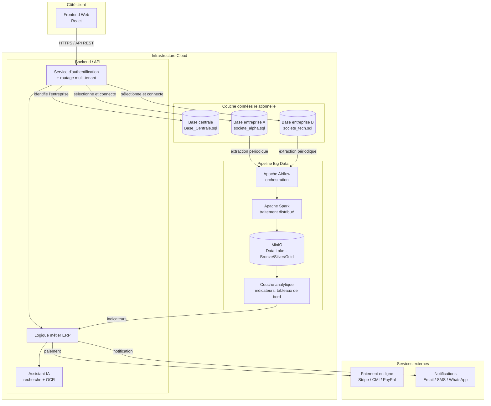
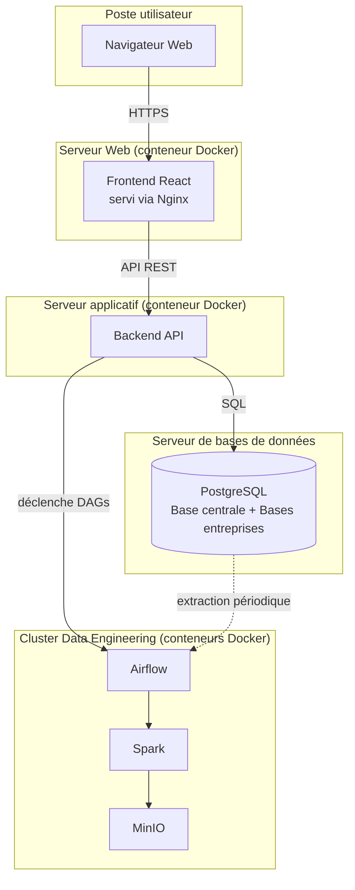

# Diagramme de composants et de déploiement — Plateforme ERP SaaS

> Ce diagramme donne la vue technique globale de l'architecture, en
> cohérence avec les sections 3 (Multi-Tenant/Multi-Database), 6 (Data
> Engineering) et 13 (Cloud Computing) du cahier des charges.

## Diagramme de composants (Mermaid — s'affiche automatiquement sur GitHub)

## Diagramme de déploiement (vue infrastructure)

## Notes de modélisation

- Le **diagramme de composants** montre les modules logiques et leurs
  interactions ; le **diagramme de déploiement** montre où ces modules
  s'exécutent physiquement (conteneurs, serveurs).
- Le routage multi-tenant (Auth → Base centrale → Base entreprise) est
  représenté ici au niveau composant ; le détail pas-à-pas est dans le
  diagramme de séquence de routage réalisé par ta binôme.
- Pour un stage de 3 mois, l'architecture réelle pourra être simplifiée en
  déploiement local via **Docker Compose** (un conteneur par composant :
  frontend, backend, PostgreSQL, Airflow, Spark, MinIO), sans nécessiter de
  vraie infrastructure Cloud multi-serveurs — à mentionner explicitement
  dans le rapport comme choix pragmatique pour la durée du stage.
- Les bases par entreprise (`EntA`, `EntB`) sont représentées en exemple ;
  en réalité leur nombre est dynamique (une base créée automatiquement par
  entreprise inscrite, cf. section 3.2 du cahier des charges).
